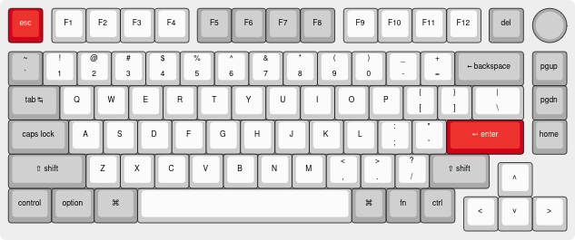

<a href="https://editor.keyboard-tools.xyz/#share=NrDeCIGNwLnBiAJgRgAwCZkENwBpwAusCAZmeXuDjAOwC++ApgM7S4QAesqAdOgKz5oceJDHjKREahmzwDcADFklRelUBmVQBY8nbn0FRi8LGfPz8i-qoBsqmqoAce8Fxi8BQk+IkLFAJyqaMEqVsjq7G4GXsYi5hYKiIwANq7unkbMALbEAE4A9gQA+oyQyGFU3ArgALq4YOAAnjFZuXCU1PwKAH4AOgB2AAauwgi+YpbgAISDlQACg5EIg1r4ACSDuvgApIM2+AB6g-b4AGSDjvgAVIMu+AAUg0H4AJSDqJTFgwC0lADUgwAvKMTAkzJ1YDR8AB3WDoBSAPg3AAw7AAIAEZYSAAa2YAAcsYx0q0FHiAOYAVzxdQaEDhMGQPG6+AIWHRqMAftSgkQTaAKACKlAA6pQAKKUABKlAAKpQAJqUACqlAAkpQAPKUAAKri6ClAg2AlDog1qrnpjOZ4AAPoM+n1iR5DN54uDIbRSWTEAMaY0LTwaFbIFg8cxUSkCjjueMJlMAIKUADKlAAIqpKABxSgACUoAClKABpSgAGV1sCtMEGAG5KA7BgByaNINCYHAskzkCj4ajQ8D09CGBSAVsJUYwBgRGHlHZkXQhwe3CCZZHIFAALArZIn1P3wof4QDnhKjmGuAJYkIhRMaiWMKABalAAGpQAMKUABqlAAQpQAHKUABZcsYCtAAeQZ8HwAA+QYeEoAB+QYAHpmwXd0+39QMFCPE9zyIHd9AZbRnWaWAfl4QM5xvXwpkAEaBfQgFoYHIkjrzQ2FYEZAQFEgAoJ0KNIon9bj8AKPECFPPjzU4-dwEADGJm15d1UA4mBbFk1C3R7KEFAU-ASB9IQCDyNICOiBkNBIpiWMouIYxohRACGgShAFGgShAGGgOpaiAA">
  
</a>

**[editor.keyboard-tools.xyz](https://editor.keyboard-tools.xyz/)**

A modern reimplementation of the [Keyboard Layout Editor](http://www.keyboard-layout-editor.com), designed for better user experience while maintaining full compatibility with existing layouts — with built-in plate and PCB generators for the DIY keyboard community.

## Resources

Full documentation is available at **[editor.keyboard-tools.xyz/docs](https://editor.keyboard-tools.xyz/docs)**

**See also**:

- [KiCad plugin for automatic keyboard's key placement and routing](https://github.com/adamws/kicad-kbplacer)
- [Modifying ergogen layouts without learning ergogen](https://adamws.github.io/modifying-ergogen-layouts-without-learning-ergogen/)

## Support

The best way to support this project is to **star this repository on GitHub** and share layouts using kle-ng share links — it helps others discover the project.
